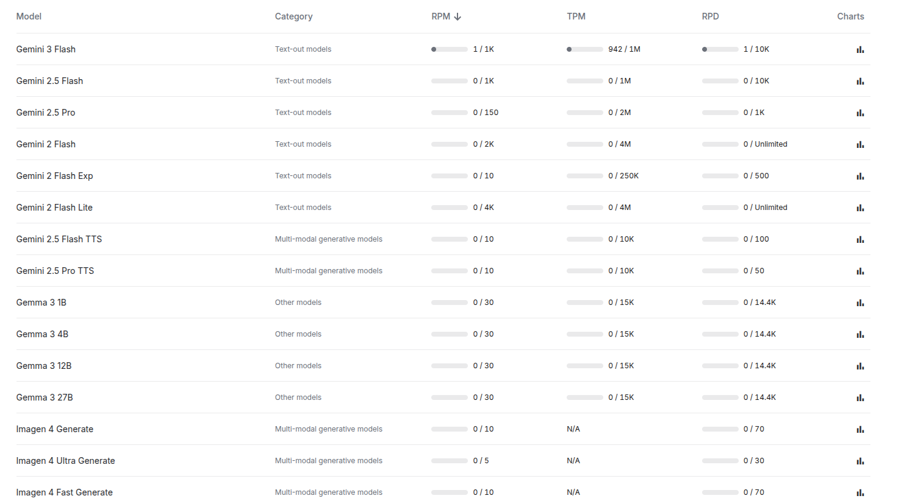


**PRODUCT REQUIREMENTS DOCUMENT**

**MONTGOMERY**

**COMMAND CENTER**

*A Unified City Transformation Platform*

**Four Integrated Modules  |  32 Features  |  40+ Data Sources**

Public Safety  +  Youth Violence Prevention  +  Urban Regeneration  +  Economic Intelligence

**Sentinel MGM**  —  AI Force Multiplier for 290-Officer Police Department

**YouthShield**  —  Youth Violence Prevention & Intervention Coordination

**Blight-to-Bright 2.0**  —  AI Urban Regeneration Engine with Market Intelligence

**DataCenter Compass**  —  Community Impact Intelligence for $3B+ Data Center Investment

World Wide Vibes Hackathon  |  Alabama State University  |  City of Montgomery

**Exclusively designed for the City of Montgomery, Alabama**

**Montgomery Command Center**	*Product Requirements Document*
# **Table of Contents**
**1.**  Executive Summary

**2.**  Problem Statement

**3.**  Product Vision

**4.**  Target Users & Personas

**5.**  Platform Architecture Overview

**6.**  Module 1: Sentinel MGM — Public Safety Force Multiplier

**7.**  Module 2: YouthShield — Youth Violence Prevention

**8.**  Module 3: Blight-to-Bright 2.0 — Urban Regeneration

**9.**  Module 4: DataCenter Compass — Economic Impact Intelligence

**10.**  Cross-Module Intelligence & Synergies

**11.**  Complete Data Sources Inventory

**12.**  Technical Architecture

**13.**  UI/UX Design Principles

**14.**  Implementation Roadmap

**15.**  Success Metrics & KPIs

**16.**  Risk Analysis & Mitigation

**17.**  Commercialization Strategy

**18.**  Competitive Landscape

**19.**  Appendix: Data Dictionary

Page  — CONFIDENTIAL
**Montgomery Command Center**	*Executive Summary*
# **1. Executive Summary**
Montgomery Command Center is a unified web platform that transforms how the City of Montgomery addresses its four most critical and interconnected challenges: public safety with a critically understaffed police department, youth violence claiming lives of residents under 21, urban blight depressing neighborhoods across all 9 council districts, and the uncertain community impact of over $3 billion in incoming data center investment.

Rather than treating these as isolated problems with separate tools, Montgomery Command Center recognizes what the city's own data reveals: crime, blight, youth disengagement, and economic disparity are symptoms of a single interconnected urban system. A block with persistent nuisance complaints attracts crime, which drives out businesses, which eliminates youth employment, which feeds the violence cycle. Conversely, when a blighted parcel is remediated, surrounding incidents decrease, business confidence rises, and youth programs gain safe operating space.

The platform integrates four specialized modules under one roof, sharing a unified geospatial data layer, a common authentication system, and cross-module intelligence that surfaces patterns invisible to any single tool.

## **The Four Modules**
**MODULE 1: SENTINEL MGM — Public Safety Force Multiplier**

Makes each of Montgomery's 290 police officers as effective as 1.7 through AI-optimized patrol positioning. Generates dynamic 'force multiplier zones,' shift deployment optimization, SB 298 compliance tracking, and recruitment ROI projections. Ingests 55,728 fire/rescue incidents, 911 call patterns, social media police feeds, and news reports.

**MODULE 2: YOUTHSHIELD — Youth Violence Prevention & Intervention**

Coordinates Montgomery's fragmented youth violence prevention ecosystem (CrimeStoppers, SOOP, churches, schools, Parks & Rec) through a shared intelligence layer. Identifies after-school gap zones, routes appropriate interventions, and measures program effectiveness longitudinally. Addresses the crisis: 50%+ of 2024 homicide arrests involved suspects age 21 or under.

**MODULE 3: BLIGHT-TO-BRIGHT 2.0 — Urban Regeneration Engine**

Generates actionable regeneration blueprints for Montgomery's 598 city-owned properties and 6,103 nuisance complaints. Combines city data with real-time Zillow/Redfin market intelligence to identify where private investment is approaching blighted areas, enabling catalytic city intervention. Includes affordable housing preservation alerts.

**MODULE 4: DATACENTER COMPASS — Economic Impact Intelligence**

The first tool that lets a mid-size city model the cascading community impact of data center development. Interactive simulation of Meta's $1.5B facility + AWS + Google on utility costs, jobs, housing, environment, and tax revenue over 5-20 year horizons. Includes community benefit agreement designer and comparable city benchmarking.

## **Why These Four Together**
Dr. Kennley Obus, hackathon judge and ASU professor, explicitly encouraged interdisciplinary solutions: 'It's okay if one stream kind of touches another stream... in academia we're always talking about interdisciplinary.' The scoring criteria allocate 15 points to challenge consistency and 10 to originality. A unified platform that addresses public safety, workforce development, smart cities, AND civic access simultaneously maximizes both.

More importantly, the data connections are real. When Sentinel MGM identifies a crime hotspot, Blight-to-Bright can show it correlates with a cluster of unaddressed nuisance complaints. When YouthShield maps after-school activity gaps, it reveals the same neighborhoods where DataCenter Compass projects the least benefit from incoming investment. The unified platform makes these connections actionable.

Page  — CONFIDENTIAL
**Montgomery Command Center**	*Problem Statement*
# **2. Problem Statement**
Montgomery, Alabama — the birthplace of the modern civil rights movement, state capital, and a city of 200,603 residents — faces a convergence of four interconnected crises that threaten its trajectory as a city. Each crisis is well-documented in city data, confirmed by hackathon judges, and reported extensively in local media. Together, they form a systemic challenge that no single-purpose tool can address.
## **2.1 Police Understaffing & Rising Crime**
The Montgomery Police Department operates with 290 officers against a recommended staffing level of 490, losing 2-3 officers per week to attrition. Violent crime increased 15% year-over-year, business robberies surged 180%, and vehicle thefts are among the highest in the nation. The city has a 1-in-34 chance of victimization, making it safer than only 14% of US cities. State Senate Bill 298 threatens an Alabama Law Enforcement Agency (ALEA) takeover if Montgomery cannot meet the threshold of 2 officers per 1,000 residents. Starting police salary is $47,000 versus $52,000 for firefighters, contributing to recruitment challenges.

Mayor Steven Reed cited 'continued momentum' in public safety in February 2026 and referenced 'major drops in violent crime' in 2025, but the staffing crisis remains existential. Governor Kay Ivey declared public safety her top legislative priority for 2026. The Metro Area Crime Suppression (MACS) unit — a multi-agency collaboration — is being expanded. The city needs tools that multiply the effectiveness of the officers it has, not just tools that predict where crime will happen.
## **2.2 Youth Violence Epidemic**
Over 50% of Montgomery's 2024 homicide arrests involved suspects age 21 or under. Alabama has the 5th highest rate of gun violence per capita in the US, costing the state $15.4 billion annually. A Montgomery police officer told a community gathering: 'I have a scrapbook in my phone where I have over 80 kids that I've known that either died to gun violence or killed somebody.' Central Alabama CrimeStoppers launched a youth crime prevention program in April 2025, teaching 'peer mediation' skills. SOOP (Stay Out Of Prison) hosts community discussions. The Alabama Department of Youth Services, local churches, and Montgomery Public Schools all operate intervention programs.

The core problem is fragmentation. These organizations operate in silos with no shared data, no coordination on geographic coverage, no longitudinal outcome measurement, and no way to identify the 3PM-8PM 'danger window' after school where youth have no structured activities within walking distance. No platform exists to coordinate community violence intervention at the city level.
## **2.3 Urban Blight & Vacant Properties**
Montgomery has 598 city-owned properties, 6,103 active nuisance complaints (litter, junk vehicles, overgrown grass, abandoned structures), and 815 code violations across all 9 council districts. The city is actively pursuing HUD demolition clearance for long-abandoned properties. Economically depressed older neighborhoods coexist blocks away from areas of new growth. WalletHub ranked Montgomery the most affordable city for homebuyers, but this masks deep geographic disparity.

Bren Baken (ASU, hackathon judge) stated: 'We have a lot of parts of the city that are economically depressed, a lot of abandoned buildings, some rundown areas. There is interest in innovating and imagining what the city can do with land that the city owns, with abandoned land.' The city received HUD PRO Housing program funding and is building new community centers (Calmar, $2.5M). But decisions about which parcels to prioritize and what reuse is viable remain ad hoc — there is no systematic framework connecting blight data to regeneration opportunities.
## **2.4 Data Center Impact Uncertainty**
Montgomery faces over $3 billion in combined data center investment: Meta expanded from $800M to $1.5B (September 2025) for a 1.3M sq ft campus, AWS is building a large facility, and Google is constructing in the area. These represent the single largest private capital investment in the city's history. Simultaneously, the Alabama Port Authority broke ground on the Montgomery Intermodal Container Transfer Facility in February 2025 (projected 2,618 jobs, $340M in business revenue), and the city is pursuing a $100M+ convention center.

Bren stated explicitly on the judge call: 'Data centers don't employ many people. What does this mean for cost of water, cost of electricity, noise pollution, environmental concerns? How do we turn this into an economic opportunity? I'm not sure many solutions have been worked through.' The city has no tool to model the cascading effects of these investments on utility costs, permanent job creation, housing prices, or environmental impact. Decisions about tax incentives and community benefit agreements are being made without data.
## **2.5 The Systemic Connection**
These four problems are not independent. City data reveals the connections: Blocks with the highest nuisance complaint density (blight) also show elevated crime incident rates (safety) and the fewest youth programming options (youth violence). The neighborhoods least likely to benefit from data center economic spillover (economic disparity) are the same ones with the worst infrastructure equity scores. A unified platform that traces these connections — and enables coordinated interventions across all four domains — represents a fundamentally different approach than four separate tools.

Page  — CONFIDENTIAL
**Montgomery Command Center**	*Product Vision*
# **3. Product Vision**
Montgomery Command Center is a unified, web-based city transformation platform that empowers Montgomery's leadership to see the city as an interconnected system and act on it. The platform delivers four specialized modules — Sentinel MGM, YouthShield, Blight-to-Bright 2.0, and DataCenter Compass — on a shared geospatial data layer, unified authentication, and cross-module intelligence engine.

## **Vision Statement**
**Enable the City of Montgomery to transform its four most critical challenges — public safety, youth violence, urban blight, and data center economic uncertainty — into a coordinated, data-driven strategy that no individual tool could achieve. Montgomery becomes the first mid-size American city to deploy a unified intelligence platform that connects crime patterns to blight, blight to economic opportunity, economic opportunity to youth employment, and youth employment back to public safety.**

## **Design Principles**
- Montgomery First: Every feature is designed for Montgomery's specific context, data, history, and people. This is not a generic platform adapted for Montgomery; it is built from Montgomery's reality outward.
- Unified Intelligence: The platform reveals patterns invisible to any single module. A crime hotspot in Module 1 links to a nuisance cluster in Module 3, which connects to a youth activity gap in Module 2, which maps to an economic dead zone in Module 4.
- Actionable, Not Just Analytical: Every insight generates a recommended action with a named responsible entity. 'Deploy peer mediation team to Zone X' not 'Zone X has elevated risk.'
- Privacy by Design: Aggregated data only. No personally identifiable information in any layer. Youth data is protected by strict anonymization at the zone level (H3 hexagonal grid). Ethical review board has veto power over features.
- Real-Time + Historical: Live social media and news signals merged with 5+ years of historical city data. The system sees both what is happening now and what has happened before in the same place.
- Built for Decision Makers: Three interface tiers: Mayor/CTO command view, department-level operational dashboards, and citizen-facing transparency portal. Each sees the same data at the appropriate level of detail.
- Mobile-First for Field Workers: Police shift commanders, code enforcement officers, and community intervention teams access the platform on tablets in the field, not just on desktop screens in offices.

Page  — CONFIDENTIAL
**Montgomery Command Center**	*Target Users*
# **4. Target Users & Personas**

|**Persona**|**Role**|**Primary Module(s)**|**Key Need**|
| :- | :- | :- | :- |
|**Dr. Tony Porterfield**|CTO, City of Montgomery|All 4 (Command View)|Real-time data he can take to the mayor for decision-making|
|**Shift Commander**|MPD Patrol Supervisor|Sentinel MGM|Optimal patrol deployment for 12-15 officers per shift|
|**Moses Harper**|SOOP Founder / CVI Worker|YouthShield|Coordination with other programs, outcome measurement for grants|
|**Code Enforcement Officer**|City Planning Dept|Blight-to-Bright 2.0|Prioritized inspection queue with regeneration context|
|**Bren Baken**|AVP Planning, ASU|DataCenter Compass|Evidence-based modeling for community impact assessment|
|**Council Member (Dist. 4)**|City Council|All 4 (District View)|Equitable resource allocation data for advocacy|
|**Mayor Steven Reed**|Mayor, City of Montgomery|All 4 (Executive Briefings)|Weekly auto-generated city transformation progress reports|
|**Montgomery Resident**|Citizen|Transparency Portal|What's happening in my neighborhood across all 4 domains|
|**School Counselor**|Montgomery Public Schools|YouthShield|After-school gap information and intervention referral pathways|
|**Planning Director**|Economic Development|DataCenter + Blight|Combined view of incoming investment and land reuse opportunities|

Page  — CONFIDENTIAL
**Montgomery Command Center**	*Platform Architecture*
# **5. Platform Architecture Overview**
Montgomery Command Center follows a modular monolith architecture with four domain modules sharing a unified data layer, authentication system, and cross-module intelligence engine. Each module can operate independently, but the real value emerges from their integration.

## **Architectural Layers**
**Layer 1: Shared Data Foundation**

All 40+ data sources (city CSVs, web-scraped real estate, social media, news, federal databases) are ingested into a unified PostgreSQL database with PostGIS spatial extensions. A Neo4j knowledge graph connects entities across datasets through shared geography (parcels, addresses, coordinates, districts) and time (dates, months, years). Every record has a spatial index and temporal index enabling cross-module queries.

**Layer 2: Module Intelligence Engines**

Each module runs its own specialized AI/ML pipeline: Sentinel MGM uses spatiotemporal prediction and vehicle routing optimization. YouthShield uses zone-level risk aggregation and intervention matching. Blight-to-Bright uses k-nearest-neighbors for regeneration template matching. DataCenter Compass uses agent-based simulation and Monte Carlo modeling. All four engines write their outputs back to the shared data layer, enabling cross-module discovery.

**Layer 3: Cross-Module Intelligence**

The Cross-Module Intelligence (CMI) engine runs nightly batch analysis and event-driven triggers to identify patterns spanning modules. Example: 'Nuisance cluster in District 4 (Blight) correlates with elevated incident rates (Sentinel) and after-school gap zone (YouthShield). The nearest data center development zone (Compass) is 2.3 miles away with no projected employment benefit to this area. Recommended: prioritize for coordinated intervention.'

**Layer 4: Presentation & Access**

React frontend with role-based access control (RBAC). Three tiers: Executive Command View (mayor/CTO), Operational Dashboards (department staff), and Citizen Transparency Portal (public). Mapbox GL provides the unified geospatial layer shared across all modules. Responsive design for desktop, tablet, and mobile.

## **Cross-Module Data Flow Diagram**
*Sentinel MGM feeds incident hotspot data to Blight-to-Bright (crime-blight correlation), to YouthShield (violence proximity to schools), and receives nuisance data from Blight-to-Bright as environmental criminology input. YouthShield feeds activity gap zones to Blight-to-Bright (community garden and recreation recommendations for vacant parcels near schools). DataCenter Compass feeds economic projections to all three modules (projected employment zones inform patrol redeployment, youth program targeting, and regeneration priority scoring). Blight-to-Bright feeds parcel regeneration status to Sentinel (remediated areas should see reduced patrol priority over time) and to DataCenter Compass (available land for economic development near data center zones).*

Page  — CONFIDENTIAL
**Module 1: Sentinel MGM**	*Public Safety Force Multiplier*
# **6. Module 1: Sentinel MGM**
**AI Force Multiplier for Montgomery's 290-Officer Police Department**

## **Module Problem Statement**
With only 290 officers serving a city that needs 490, Montgomery cannot hire its way out of this crisis fast enough. The MACS unit is being expanded, Governor Ivey has prioritized public safety, and Mayor Reed reports 'momentum' in crime reduction. But the fundamental staffing gap means every officer must be positioned for maximum impact. Current deployment relies on static beat assignments. No existing tool optimizes patrol effectiveness specifically for chronically understaffed departments. License plate readers have helped solve 68 felonies; downtown revitalization reduced property crimes 18%; but auto thefts rose 14% along I-85. The challenge is not prediction alone — it is optimization under severe constraint.

## **Features (8 Features, All Preserved)**
**[P0] S1. Dynamic Force Multiplier Zone Map**

Real-time heat map showing where a single officer's visible presence yields maximum deterrent effect based on historical patterns. Calculates a 'prevention multiplier score' for every zone in the city. Updated every shift change (approximately every 8 hours) using the latest incident data, nuisance patterns, and social media signals. Uses gradient boosted trees trained on 55,728 fire/rescue incidents with spatiotemporal features. Zones are H3 hexagonal cells at resolution 7 (approximately 5.2 km2) for operational clarity.

**[P0] S2. Shift Deployment Optimizer**

Given N officers available for a shift, generates optimal patrol route assignments that maximize coverage probability across all 9 council districts while respecting response time constraints. Based on a modified Vehicle Routing Problem (VRP) solver adapted for patrol allocation. Accounts for: officer fatigue (no back-to-back high-intensity zones), shift overlap requirements, and mandatory coverage of critical infrastructure (schools, hospitals, commercial corridors). Outputs a printable shift assignment sheet and a digital map pushed to patrol vehicle tablets.

**[P0] S3. SB 298 Compliance Dashboard**

Tracks Montgomery's progress toward the 2 officers per 1,000 residents threshold required by State Senate Bill 298 that would allow ALEA to take over MPD if unfulfilled. Projects compliance timeline under current hiring rate, current attrition rate, and multiple what-if scenarios (e.g., 'What if starting salary increases to $52K? Projected attrition reduction: 30%. New compliance date: Q3 2028.'). Generates formatted compliance reports for ALEA submission and city council briefings. Includes a public-facing version showing the city's staffing trajectory to build citizen confidence.

**[P1] S4. Recruitment ROI Calculator**

Models the financial and safety return on every new hire: 'Adding 1 officer to District X night shift reduces projected incidents by Y per month, saving $Z in property loss, medical costs, and insurance claims.' Uses historical incident-to-cost models calibrated to Montgomery-specific data (property values from Zillow, medical cost estimates from Alabama Department of Public Health). Generates executive-ready investment justifications for budget season. Compares cost-of-hiring against cost-of-crime for every district and shift combination.

**[P1] S5. Business Robbery Predictor**

Identifies commercial corridors with elevated robbery risk based on: time-of-day patterns, business type clustering, recent incident proximity, lighting conditions, and foot traffic data. Business robberies surged 180% in 2024; this feature directly addresses that spike. Cross-references Business\_License.csv locations with incident data to generate a 'Commercial Vulnerability Index' for every business corridor. Alerts shift commanders when risk exceeds thresholds: 'Atlanta Highway commercial strip elevated risk Thursday 6-10PM based on 8-week pattern.'

**[P1] S6. Community Violence Intervention Targeting**

Identifies neighborhoods where CrimeStoppers, SOOP, and other community programs would achieve maximum impact based on incident density, youth demographic concentration, and program coverage gaps. This feature bridges Sentinel MGM into YouthShield — the incident patterns from Module 1 directly inform intervention targeting in Module 2. Generates recommended deployment maps for CVI workers.

**[P1] S7. News-Augmented Situational Awareness**

Scrapes WSFA.com, Montgomery Advertiser, and AL Reporter for incident reports that add real-time context to pattern analysis. NLP pipeline extracts: location, incident type, and severity from news articles. Reconciles news reports against official incident data to identify coverage gaps and emerging trends not yet visible in structured data. Alerts: 'WSFA reports commercial break-in on Fairview Ave not yet in system — pattern matches District 5 trend.'

**[P2] S8. Social Media Police Intelligence Feed**

Monitors Twitter @MPDMontgomery and @CityofMGM for real-time police activity updates, community safety announcements, and citizen reports. Sentiment analysis tracks public confidence in MPD over time. Identifies emerging community concerns before they become formal complaints. Feeds into force multiplier zone calculations as a real-time signal layer. Does NOT monitor individual citizens — only public official channels and aggregate community sentiment.

Page  — CONFIDENTIAL
**Module 2: YouthShield**	*Youth Violence Prevention*
# **7. Module 2: YouthShield**
**AI-Powered Youth Violence Prevention and Intervention Platform**

## **Module Problem Statement**
Over 50% of Montgomery's 2024 homicide arrests involved suspects age 21 or under. CrimeStoppers launched its youth crime prevention program in April 2025. SOOP hosts community discussions. The Alabama Department of Youth Services, local churches, Montgomery Public Schools, and Parks & Recreation all operate intervention programs. But these organizations operate in silos — no shared data, no coordination on geographic coverage, no longitudinal outcome measurement, and no systematic identification of the 3PM-8PM 'danger window' where youth have no structured activities. Alabama's Glock switch ban (SB116) passed with bipartisan support, but legislation alone cannot address the root causes. Communities need a coordination layer.

## **Features (8 Features, All Preserved)**
**[P0] Y1. Youth Risk Heat Map**

Aggregated, privacy-preserving zones showing elevated youth violence risk based on multi-source signals: incident proximity to schools, temporal clustering during after-school hours, social media conflict escalation signals near youth gathering spots, and environmental disorder indicators. NEVER identifies individuals. Uses H3 hexagonal grid at resolution 8 (approximately 0.74 km2) for zone-level aggregation. Updated weekly with monthly trend overlays. Color-coded from green (low risk) to red (elevated risk) with trend arrows showing direction of change.

**[P0] Y2. Intervention Routing Engine**

Matches identified risk zones to available interventions based on: intervention type (peer mediation, mentorship, sports programming, counseling), provider capacity, geographic coverage, and effectiveness history. When a zone shows elevated risk, the system recommends specific actions: 'Zone X elevated — CrimeStoppers peer mediation team has capacity, nearest deployment point is Capitol Heights Community Center, 0.3 miles from zone center. Alternatively: SOOP mentor available Thursday afternoons.' Sends notifications to intervention providers with zone context.

**[P0] Y3. After-School Gap Analyzer**

Maps the 3PM-8PM 'danger window' against available structured activities citywide. For every block, calculates: walking distance to nearest community center, community center hours (many close at 5PM), parks with active programming, church youth groups, and sports leagues. Identifies blocks where youth have ZERO access to structured programs within 15-minute walking distance. Outputs: 'Gap Zone Report: 23 blocks in District 4 have no structured youth programming within walking distance during 4-7PM. Nearest community center (Earl D. James) closes at 5PM. Recommendation: extend hours or deploy mobile programming.'

**[P0] Y4. Program Effectiveness Tracker**

Longitudinal measurement of whether interventions reduce incidents in treated areas versus comparable untreated areas. Uses a difference-in-differences statistical framework: 'Schools that received peer mediation training showed 23% fewer nearby incidents in the following 6 months compared to matched control schools.' Tracks: intervention deployment date, dosage (how many sessions/contacts), and zone-level outcome change. Gives grant makers and city leadership data-backed evidence for continued investment. Breaks the cycle of funding programs with no outcome data.

**[P1] Y5. Resource Coordination Dashboard**

Shows all active youth programs in Montgomery, their geographic coverage areas, current capacity, and service gaps on a single map. Prevents duplication (two organizations serving the same block while adjacent blocks have nothing) and identifies underserved zones. Each program has a profile: organization name, program type, age range served, capacity, days/hours, and contact. Partners include: CrimeStoppers, SOOP, Montgomery Parks & Rec, MPS after-school programs, YMCA, church youth ministries, Alabama Department of Youth Services.

**[P1] Y6. Community Asset Map (Prevention Infrastructure)**

Maps POSITIVE resources for youth: mentors, community centers (22 locations with hours and facilities), parks with active programming (65 parks), sports leagues, job training programs, libraries (13 branches), and church youth groups. Reframes the conversation from 'where is the problem?' to 'where are the assets?' and 'where are the gaps between problems and assets?' Layered visualization shows: red zones (elevated risk) vs. green zones (strong asset density). The gap between the two colors reveals where intervention investment would have highest impact.

**[P1] Y7. School Safety Perimeter Monitor**

Aggregated incident trends within 500m and 1km radius of each of Montgomery's 85+ schools. Auto-alerts school administrators when patterns shift significantly: 'Incidents within 500m of Bellingrath Middle School up 40% month-over-month. Primary type: assault. Peak time: 3:15-4:30PM.' Enables proactive measures: adjusted dismissal procedures, crossing guard deployment, or police presence requests. Never shares individual incident details with schools — only aggregated zone-level trends.

**[P2] Y8. Grant Impact Reporter**

Auto-generates formatted reports for federal Community Violence Intervention grants showing measurable outcomes: zones covered, interventions deployed, pre/post incident comparison, program effectiveness scores, and dollar-to-impact ratios. Federal CVI funding requires outcome reporting; this automates it. Exportable as PDF for grant applications, renewal justifications, and compliance submissions. Includes visualization-ready charts for presentations to funders and city council.

Page  — CONFIDENTIAL
**Module 3: Blight-to-Bright 2.0**	*Urban Regeneration Engine*
# **8. Module 3: Blight-to-Bright 2.0**
**AI Urban Regeneration Engine with Real Estate and Community Intelligence**

## **Module Problem Statement**
Montgomery has 598 city-owned properties, 6,103 active nuisance complaints, and 815 code violations. The city is actively pursuing HUD demolition clearance and has received PRO Housing funding. WalletHub ranked Montgomery the most affordable city for homebuyers (median ~$190K), but inventory surged 53.6% year-over-year, suggesting market softness in some areas. New community centers are under construction. Yet decisions about which parcels to prioritize, what reuse is viable, and whether to invest in affordable housing preservation versus market-rate redevelopment remain ad hoc. No tool connects blight data to actionable regeneration opportunities while accounting for real-time market dynamics.

## **Features (8 Features, All Preserved)**
**[P0] B1. Blight Severity Scoring Engine**

Every parcel receives a dynamic score (0-100) based on: number and type of active nuisance complaints, code violation status and duration, lien history (filed vs. NA), vacancy duration estimate, proximity to other blighted parcels (contagion factor), and historical recidivism (parcels cleaned then re-violated). Scores update weekly as new complaints and violations are filed. The scoring algorithm weights recent activity higher than historical to reflect current conditions. Parcels scoring above 75 are auto-flagged as 'critical' for planning department review.

**[P0] B2. Regeneration Blueprint Generator**

AI recommends specific reuse options for every blighted or vacant parcel based on: zoning classification, lot size, surrounding land use, infrastructure access (water, sewer, road condition), proximity to schools and community centers, and patterns from successfully redeveloped Montgomery parcels. Recommendations include: affordable housing infill, community garden, commercial space, pocket park, mixed-use development, or urban farm. Each recommendation includes a viability percentage based on k-nearest-neighbors analysis of similar parcels that were successfully redeveloped. Example output: 'Parcel X (0.5 acres, R-65 zoning, District 4): 3 active complaints, adjacent to $2M renovation. Top recommendations: community garden (78% viability), affordable housing (65%), pocket park (61%).'

**[P0] B3. Real Estate Market Momentum Overlay**

Web-scrapes Zillow and Redfin for real-time Montgomery property listings, sale prices, and market velocity data. Overlays on the blight map to show where private investment is approaching blighted areas. Identifies 'catalytic intervention points' — parcels where a modest city investment would tip the block from declining to improving because market forces are already moving toward it. This is the key differentiator from v1.0: the city doesn't fight the market; it catalyzes it. Example: 'Block Y has 4 blighted parcels but 3 new Zillow listings within 500m, median asking price up 12% QoQ. City intervention here has 3x the impact of an equivalent investment in a block with no market momentum.'

**[P1] B4. Affordable Housing Preservation Alert System**

Flags parcels in rapidly appreciating corridors where affordable housing zoning should be applied NOW before price escalation excludes current residents. Cross-references code violation locations with Zillow price trend data and Montgomery Housing Authority voucher density. When a neighborhood shows both rising prices AND high voucher concentration, the system alerts: 'Warning: Block Z shows 18% appreciation with 34 active housing vouchers within 500m. Without affordable housing zoning, projected displacement: 15-25 households within 24 months. Recommend: inclusionary zoning overlay or affordable housing set-aside for city-owned parcels.'

**[P1] B5. Neighborhood Blight Contagion Tracker**

Models how blight spreads to adjacent parcels AND how remediation creates positive spillover effects. Uses spatial diffusion modeling: when a blighted parcel is surrounded by well-maintained properties, it spreads more slowly. When surrounded by other blight, it accelerates. Conversely, when a parcel is remediated, the model predicts how quickly positive effects propagate to neighbors. Enables targeting: 'Remediating Parcel A (contagion score: 8.2) prevents projected spread to 3 adjacent parcels within 12 months. Remediating Parcel B (contagion score: 3.1) has minimal spillover benefit.' Helps planning department invest where impact multiplies.

**[P1] B6. HUD Compliance & Federal Reporting Dashboard**

Tracks demolition progress against HUD clearance approvals, PRO Housing program targets, and CDBG (Community Development Block Grant) requirements. Auto-generates federal compliance reports with parcel-level detail: demolition completed, rehabilitation initiated, affordable units created or preserved. The city received HUD clearance to begin demolition of long-abandoned properties; this dashboard ensures timely execution and reporting. Includes photo documentation upload for before/after compliance evidence.

**[P2] B7. Community Proposal Portal**

Residents suggest reuse ideas for specific parcels and vote on proposals. Each parcel's public page shows its blight score, current condition, zoning, and AI recommendations. Citizens can add context the data misses: 'This lot floods every spring' or 'The neighborhood wants a community garden here.' Citizen input is weighted into the regeneration recommendation engine alongside quantitative data. Includes a moderation layer for inappropriate content. Community engagement metrics feed into federal grant applications demonstrating public participation.

**[P2] B8. Auto-Generated Council District Briefings**

Monthly reports for each of the 9 council members showing: new nuisance complaints in their district, code enforcement activity, remediation progress, top 5 priority parcels with regeneration recommendations, and comparison to citywide averages. Formatted for easy inclusion in council member newsletters to constituents. Includes a 'wins' section highlighting successfully remediated parcels and their positive outcomes (reduced surrounding complaints, increased nearby property values).

Page  — CONFIDENTIAL
**Module 4: DataCenter Compass**	*Economic Impact Intelligence*
# **9. Module 4: DataCenter Compass**
**The First Community Impact Intelligence Platform for Data Center Development**

## **Module Problem Statement**
Montgomery faces the largest private capital investment wave in its history: Meta's $1.5B data center campus (expanded from $800M in September 2025), AWS and Google facilities, the inland port (2,618 projected jobs, $340M revenue), and a planned $100M+ convention center. This convergence is unprecedented for a city of 200,000. Yet as Bren stated: data centers employ very few people permanently (~100 operational jobs per facility despite 1,000+ construction jobs). The concerns are real: water consumption for cooling, electricity demand competing with residential rates, noise pollution, and the question of whether these investments benefit existing residents or bypass them. No municipality in America has a tool to model these cascading effects before construction begins.

## **Features (8 Features, All Preserved)**
**[P0] D1. Multi-Project Impact Dashboard**

Central visualization showing the projected combined impact of all major incoming investments: Meta data center, AWS facility, Google facility, inland port, and convention center. Displays: utility cost projections, job creation timelines (distinguishing construction vs. permanent), housing market pressure, traffic impact, tax revenue, and water demand. All projections show confidence intervals based on Monte Carlo simulation. The key insight: these projects interact. The inland port increases trucking traffic, which changes road conditions, which affects data center construction timelines. The convention center generates tourism spending that benefits different neighborhoods than data center tax revenue. This is the only tool that models them together.

**[P0] D2. What-If Scenario Simulator**

Interactive variable sliders enabling city officials to model scenarios: 'What if Meta expands to 2M sq ft?' 'What if we require 100% renewable energy?' 'What if the convention center opens 2 years late?' 'What if the inland port exceeds job projections by 30%?' Each scenario adjustment ripples through all impact dimensions in real-time. Officials can save, name, and compare scenarios side-by-side. Supports the negotiation process: 'If we offer 10-year tax abatement, projected tax revenue loss over period is $X. If we negotiate a 7-year abatement with community benefit requirements, net community value increases by $Y.'

**[P0] D3. Community Benefit Agreement Designer**

Quantifies what Montgomery should ask for in negotiations with data center companies. Models the value of potential CBA components: job training funds, local hiring commitments, infrastructure contributions (road improvements, broadband expansion), utility rate stabilization guarantees, and community facility investments. Generates data-backed negotiation documents: 'Based on comparable city outcomes, Meta's $1.5B investment should generate $X in community benefits. Recommended CBA package: $Y job training fund, $Z infrastructure contribution, W% local hiring for operational roles.' Prevents the city from leaving value on the table.

**[P1] D4. Utility Cost Projector for Residents**

Cross-references construction permit data (41,872 records) with Alabama Power rate filing trajectories and Montgomery Water Works capacity data to project residential utility cost impacts. Models: 'If all three data centers come online by 2028, residential electricity costs projected to increase X-Y% based on grid capacity and rate structure analysis.' Distinguishes between rate increases caused by data center demand vs. general inflation. Gives citizens and council members specific numbers for utility cost advocacy. Includes water consumption modeling: data centers require millions of gallons daily for cooling.

**[P1] D5. Permanent vs. Temporary Jobs Analyzer**

Separates construction employment (temporary, 1,000+ per facility, 18-24 month duration) from operational jobs (permanent, 50-150 per facility). Models net employment impact including: displacement effects (construction workers driving up hospitality costs), skill requirements mismatch (operational roles require specialized technical skills not abundant in current workforce), and secondary job creation (restaurants, services near facilities). Connects to YouthShield: 'Projected data center operational roles require technical certification. Recommended: partner with ASU and Montgomery Public Schools on tech training pipeline targeting youth 16-24.'

**[P1] D6. Comparable Cities Benchmarking Module**

Web scraping module that automatically collects and analyzes outcomes from 20+ existing data center communities nationwide: Loudoun County VA, Quincy WA, New Albany OH, Prineville OR, Council Bluffs IA, and others. Extracts: actual utility cost changes, permanent job numbers, tax revenue impacts, housing market effects, and community complaints. Benchmarks Montgomery projections against real-world outcomes. Updates quarterly as new data becomes available. Provides reality checks: 'Our model projects 120 permanent jobs. Comparable facilities in similar cities averaged 87 permanent jobs. Adjusting confidence interval accordingly.'

**[P2] D7. Environmental Justice Impact Assessment**

Maps data center locations against residential areas, schools, parks, and community facilities. Models: noise pollution contours at various distances, thermal output effects, visual impact on neighboring properties, and traffic pattern changes from construction and operations. Cross-references with demographic data to assess environmental justice implications: 'Meta facility is 1.2 miles from 3 schools serving predominantly low-income populations. Recommended: noise mitigation requirements in construction permits, vegetation buffer, and air quality monitoring stations.' Generates documentation for environmental compliance and community advocacy.

**[P2] D8. Housing Market Impact Modeler**

Cross-references construction permit trends with web-scraped Zillow/Redfin data near data center zones to project housing market effects. Models both positive impacts (appreciation near construction activity) and negative impacts (rental cost pressure from temporary construction workforce). The 53.6% inventory surge and 8.6% median price increase in Montgomery County suggest a market already in flux. Distinguishes: 'Within 2 miles of Meta site: rental asking prices up 14% since announcement. Median days on market down from 78 to 52. Projection: continued appreciation of 8-12% annually during construction, moderating to 3-5% post-completion.'

Page  — CONFIDENTIAL
**Montgomery Command Center**	*Cross-Module Intelligence*
# **10. Cross-Module Intelligence & Synergies**
The transformative value of Montgomery Command Center lies not in any single module but in the intelligence that emerges when all four modules share data. The Cross-Module Intelligence (CMI) engine identifies patterns invisible to any individual module and generates coordinated intervention recommendations.

## **10.1 Synergy Map: How Modules Inform Each Other**

|**From Module**|**To Module**|**Intelligence Connection**|
| :- | :- | :- |
|Sentinel MGM|Blight-to-Bright|Crime hotspots correlate with nuisance clusters. When Sentinel identifies a persistent hotspot, Blight-to-Bright auto-elevates nearby parcels in the remediation priority queue. The hypothesis (validated in Memphis and Cleveland): remediating blight reduces crime.|
|Sentinel MGM|YouthShield|Incident locations near schools feed into YouthShield's risk heat map. Shift commanders' patrol routes can be optimized to include school perimeter presence during the 3-4PM dismissal window.|
|YouthShield|Blight-to-Bright|After-school gap zones identify neighborhoods where vacant parcels should be prioritized for youth-relevant reuse: community gardens, basketball courts, maker spaces. Blight-to-Bright regeneration recommendations weighted by YouthShield gap data.|
|YouthShield|Sentinel MGM|CVI deployment data from YouthShield informs Sentinel: zones receiving active intervention may show reduced risk, enabling patrol reallocation to unserved areas. Creates a positive feedback loop.|
|Blight-to-Bright|Sentinel MGM|Remediation status updates patrol priority: as blighted parcels are addressed, surrounding environmental criminology risk decreases. Sentinel's force multiplier zones gradually shift away from remediated areas.|
|Blight-to-Bright|DataCenter Compass|Available city-owned parcels near data center zones feed into economic opportunity mapping. DataCenter Compass can model: 'If parcels A, B, C are developed for workforce housing, data center employee commute impact reduces by X.'|
|DataCenter|YouthShield|Projected tech job creation feeds into youth training pipeline recommendations. 'Data center operations require 120 technicians within 3 years. YouthShield identifies 340 youth in target age range within 2 miles of ASU. Recommended: ASU tech certification program with guaranteed interview pipeline.'|
|DataCenter|Blight-to-Bright|Economic projections inform regeneration timing: parcels near data center development zones should be prioritized NOW before construction activity increases land values. Affordable housing preservation alerts amplified.|

## **10.2 Unified Alert Examples**
- CROSS-MODULE ALERT: District 4 convergence detected. Sentinel identifies persistent crime hotspot at Block X. Blight-to-Bright shows 4 unaddressed nuisance complaints within 200m. YouthShield shows nearest community center closes at 5PM (2-hour gap). DataCenter Compass shows no projected economic benefit from data center development within 3 miles. RECOMMENDATION: Coordinated intervention — deploy CVI team (YouthShield), prioritize nuisance remediation (Blight), increase patrol during gap hours (Sentinel), advocate for community benefit allocation from data center CBA (Compass).
- CROSS-MODULE ALERT: Positive cascade detected in District 2. Blight-to-Bright remediated 3 parcels in Block Y over past 6 months. Sentinel shows 28% reduction in nearby incidents. YouthShield shows SOOP program deployed in adjacent zone. New business license filed within 500m. RECOMMENDATION: Feature as 'Montgomery Wins' case study in Mayor's weekly briefing. Replicate approach in comparable District 4 blocks.
- CROSS-MODULE ALERT: Data center proximity opportunity. DataCenter Compass projects 1,000+ construction workers arriving for Meta facility in Q2 2027. Blight-to-Bright identifies 12 city-owned parcels within 3 miles suitable for temporary workforce housing. YouthShield flags that construction worker influx may increase traffic near 2 schools. RECOMMENDATION: Fast-track workforce housing development on identified parcels (Blight), adjust school zone traffic plans (YouthShield), model rental market impact (Compass).

## **10.3 Weekly Executive Briefing (Auto-Generated)**
Every Monday morning, the CMI engine generates a single-page executive briefing for the Mayor and CTO covering all four modules:

- Public Safety Vital Signs: patrol coverage achieved, force multiplier effectiveness, SB 298 compliance progress, week-over-week incident comparison
- Youth Violence Prevention: active intervention zones, program effectiveness scores, after-school gaps identified/filled, incident trend near schools
- Blight & Regeneration: new complaints, remediations completed, parcels in pipeline, neighborhood health score changes, HUD compliance status
- Economic Intelligence: data center development milestones, utility cost projections updated, CBA negotiation status, inland port/convention center updates
- Cross-Module Insights: top 3 convergence alerts, positive cascade case studies, coordinated intervention recommendations

Page  — CONFIDENTIAL
**Montgomery Command Center**	*Data Sources*
# **11. Complete Data Sources Inventory**
Montgomery Command Center ingests data from 40+ sources across four categories: City Open Data (CSV datasets from the Montgomery Open Data Portal), Web-Scraped Intelligence (real estate, news, social media), Federal & State Databases (USDA, HUD, census, crime archives), and Partner APIs (community organizations, utility providers). All data is refreshed on defined schedules ranging from real-time (social media) to monthly (city datasets).

## **11.1 City of Montgomery Open Data (Primary)**

|**Dataset**|**Rows**|**Module(s)**|**Usage**|
| :- | :- | :- | :- |
|Fire\_Rescue\_All\_Incidents.csv|55,728|Sentinel, YouthShield|Incident prediction, response analysis, school proximity modeling|
|Nuisance.csv|6,103|Blight, Sentinel|Blight scoring, environmental criminology input|
|Construction\_Permit\_Data.csv|41,872|Blight, Compass, Sentinel|Investment patterns, development projection, economic momentum|
|Food\_Scores.csv|1,353|Blight, YouthShield|Neighborhood health indicator, food access correlation|
|Paving\_Project.csv|1,202|Blight, Sentinel|Infrastructure investment equity, road condition impact|
|Code\_Violations.csv|815|Blight, Sentinel|Enforcement pipeline, blight severity, crime correlation|
|Received\_311\_Service\_Requests.csv|711|Blight, Sentinel|Service demand, citizen engagement, neighborhood quality|
|City\_Owned\_Properties.csv|598|Blight, Compass|Parcel inventory, regeneration opportunities, development land|
|Business\_License.csv|491|Sentinel, Compass|Commercial ecosystem, robbery targets, economic vitality|
|Utility\_Poles.csv|401|Blight|Infrastructure condition, maintenance need|
|Maintained\_Ditches.csv|355|Blight|Drainage infrastructure, flooding risk|
|Environmental\_Nuisance\_\_Old\_.csv|331|Blight|Historical trends, recidivism detection|
|DayCare.csv|199|YouthShield|Childcare infrastructure mapping|
|Education\_Facility.csv / School.csv|115 / 85|YouthShield, Sentinel|School locations, enrollment, safety perimeters|
|911\_Calls.csv|86|Sentinel|Call volume patterns, demand forecasting|
|Most\_Visited\_Locations.csv|86|Compass, Blight|Foot traffic, economic gravity centers|
|Weather\_Sirens / Tornado\_Shelter|77 / 7|Sentinel|Emergency coverage mapping|
|Parking data (5 files)|353|Compass|Downtown activity and commercial corridor health|
|Community\_Centers.csv|22|YouthShield|Intervention delivery points, hours, capacity|
|Parks\_\_\_Trails.csv / Parks\_and\_Trail.csv|65 / 98|YouthShield, Blight|Green space, recreation, community garden potential|
|Police\_Facilities.csv|19|Sentinel|Station coverage analysis, response modeling|
|Fire\_Stations.csv|16|Sentinel|Station network for coverage isochrones|
|Libraries.csv / Community\_\_\_Library.csv|13 / 31|YouthShield|Community access points, digital inclusion hubs|
|Point\_of\_Interest.csv|54|Compass|Cultural/civic landmarks context layer|
|City\_recreation.csv|54|YouthShield|Recreation facilities inventory|
|Daily\_Population\_Trends.csv|1,461|Compass, Sentinel|Population dynamics, commuter/visitor patterns|
|Visitors\_Origin.csv|4,936|Compass|Foot traffic origins, economic activity analysis|
|Pharmacy\_Locator.csv|34|YouthShield|Health resources including naloxone availability|
|Health\_Care\_Facility.csv|37|YouthShield|Hospital/clinic locations for emergency reference|
|Council districts + City Council|9 + 9|All|Political geography and representation|

## **11.2 Web-Scraped Intelligence**
- Twitter/X @CityofMGM + @MPDMontgomery: Real-time city and police communications, citizen sentiment (Sentinel, YouthShield)
- Facebook: City of Montgomery page (43,744 followers): Community engagement, event awareness, citizen feedback (All modules)
- WSFA.com + Montgomery Advertiser + AL Reporter: News incident reports, development announcements, policy changes (Sentinel, Compass)
- Zillow + Redfin (Montgomery market): Property listings, sale prices, market velocity, appreciation trends (Blight, Compass)
- Gun Violence Archive: Montgomery-specific shooting data for pattern validation (Sentinel, YouthShield)
- Comparable data center city public records: Loudoun County VA, Quincy WA, New Albany OH outcomes (Compass)
- Alabama Power rate filings: Utility cost trajectory data (Compass)
- NFPA standards documentation: Fire response time benchmarks (Sentinel cross-reference)

## **11.3 Federal & State Databases**
- USDA Food Desert Atlas: Census tract-level food access data for Montgomery (YouthShield)
- US Census Bureau: Demographic, economic, and housing data for comparable city analysis (Compass)
- HUD: PRO Housing program requirements, CDBG reporting frameworks, demolition clearance data (Blight)
- Alabama Department of Commerce: Economic development announcements, job creation reports (Compass)
- Montgomery Housing Authority: Public housing locations, voucher density (Blight)
- ALEA crime statistics: State-level benchmarking for Montgomery (Sentinel)
- National Weather Service Montgomery: Severe weather data for incident correlation (Sentinel)

## **11.4 Partner Data (Via API or Data Sharing Agreement)**
- CrimeStoppers Montgomery: Intervention deployment logs, peer mediation program schedules (YouthShield)
- SOOP (Stay Out Of Prison): Community discussion attendance, mentor deployment (YouthShield)
- Montgomery Public Schools: School calendar, after-school program schedules, meal program locations (YouthShield)
- Montgomery Chamber of Commerce: Economic indicator reports, business development pipeline (Compass)
- Montgomery Water Works: Water usage and capacity data for utility impact modeling (Compass)
- City Open Finance Portal: Expenditure, revenue, vendor payment data for budget context (All modules)

Page  — CONFIDENTIAL
**Montgomery Command Center**	*Technical Architecture*
# **12. Technical Architecture**

## **12.1 Frontend**
- Framework: React 18 with TypeScript for type safety across the large codebase
- Geospatial: Mapbox GL JS for unified map layer shared across all 4 modules. H3 hexagonal grid overlay for privacy-preserving zone aggregation
- Charts & Dashboards: Recharts for time-series, D3.js for custom visualizations (force multiplier zones, contagion models, simulation results)
- UI Components: shadcn/ui component library for consistent, professional interface across modules
- State Management: React Context + useReducer for module-level state; shared context for cross-module data
- Responsive Design: Mobile-first CSS with Tailwind utilities. Tablet-optimized for field workers (shift commanders, code enforcement)
- PWA: Service worker for offline-capable field access. Push notifications for alerts
- Authentication: Role-based access control (RBAC) with three tiers: Executive, Operational, Citizen

## **12.2 Backend**
- API Framework: Python FastAPI for high-performance async API. OpenAPI auto-documentation for all endpoints
- Database: PostgreSQL 16 with PostGIS extension for spatial queries. Partitioned by module for performance isolation
- Knowledge Graph: Neo4j for cross-dataset entity connections (parcels, addresses, districts, timestamps)
- Vector Store: Pinecone for semantic search across datasets (enables natural language queries in executive briefings)
- Cache: Redis for real-time social sentiment scores, force multiplier zone tiles, and frequently-accessed dashboard data
- Task Queue: Celery with Redis broker for async jobs: weekly score recalculations, report generation, web scraping
- ML Pipeline: scikit-learn for classification/regression (incident prediction, blight scoring). Mesa framework for agent-based economic simulation (DataCenter Compass). OSRM for route optimization (patrol routes, response isochrones)

## **12.3 Data Pipeline**
- ETL: Apache Airflow orchestrating data ingestion from all 40+ sources on defined schedules
- City CSV Ingestion: Weekly batch processing of updated city portal datasets. Schema validation and change detection
- Web Scraping: Playwright for JavaScript-rendered sites (Zillow, Redfin, news). Scrapy for simpler targets. Proxy rotation for rate limiting
- Social Media: Twitter API v2 for @CityofMGM and @MPDMontgomery. Facebook Graph API for public page data. NLP pipeline: sentiment analysis (VADER), topic extraction, location mention detection
- Address Normalization: Unified geocoding pipeline normalizing all addresses across datasets to consistent lat/lng + H3 cell assignment
- Cross-Module Linkage: Nightly batch job running CMI engine: spatial joins across module outputs, anomaly detection, convergence alert generation

## **12.4 Infrastructure**
- Hosting: Cloud deployment (AWS or Azure) with Alabama region preference for data residency
- Containerization: Docker containers orchestrated with Kubernetes for module isolation and independent scaling
- CI/CD: GitHub Actions for automated testing, linting, and deployment. Staging environment mirrors production data
- Monitoring: Prometheus + Grafana for system metrics. Sentry for error tracking. Custom dashboards for data pipeline health
- Security: HTTPS everywhere, encrypted at rest (AES-256), RBAC via JWT tokens, audit logging for all data access, SOC 2 compliance roadmap
- Backup: Daily automated PostgreSQL backups with 30-day retention. Neo4j weekly snapshots

## **12.5 Privacy Architecture**
Privacy is a first-class architectural concern, not an afterthought. The platform handles sensitive public safety and youth data with strict safeguards:

- Zone-Level Aggregation: All public-facing data aggregated to H3 hexagonal cells. Individual incidents, addresses, or persons are never displayed outside authenticated operational views
- Youth Data Protection: YouthShield module applies additional anonymization: minimum zone population threshold of 50 before displaying any metric, no incident-level data accessible even to authenticated users, no demographic breakdowns at zone level
- Role-Based Data Access: Executive tier sees aggregated metrics and trends. Operational tier sees zone-level detail for their department only. Citizen tier sees only publicly appropriate aggregated data
- Ethical Review Board: Community organizations (EJI, CrimeStoppers, ASU, NAACP Montgomery chapter) have veto power over any feature that could stigmatize neighborhoods or enable discriminatory targeting
- Data Retention: Social media scrapes retained for 90 days only. Aggregated analytics retained indefinitely. Raw incident data retained per city records management schedule
- Audit Trail: Every query, export, and report generation is logged with user identity and purpose. Quarterly audit review by CTO office

Page  — CONFIDENTIAL
**Montgomery Command Center**	*UI/UX Design*
# **13. UI/UX Design Principles**
## **13.1 Visual Design System**
- Color Palette: Each module has a distinct accent color (Sentinel: red, YouthShield: purple, Blight: blue, Compass: green) unified by a dark navy primary and warm orange highlights. The shared map layer uses neutral tones to avoid visual conflict with module-specific data overlays.
- Typography: Display headings in Georgia (serif, connecting to Montgomery's historical gravitas). Body text in DM Sans (clean, modern, highly readable at dashboard scale). Data in JetBrains Mono (monospace for numerical precision in tables and metrics).
- Map-First Interface: The shared Mapbox GL map is the central canvas occupying 65%+ of screen real estate. Module panels slide in from the side. Users navigate by clicking the map, not by navigating menus.
- Progressive Disclosure: Executive view shows 5 vital signs per module. Click to expand to full dashboard. Click again to reach operational detail. Three levels: summary, dashboard, deep-dive.
- Accessibility: WCAG 2.1 AA compliance. Color-blind safe palettes. Keyboard navigation for all features. Screen reader support for data tables and alerts.

## **13.2 Information Architecture**
- Global Navigation: Top bar with module tabs (Sentinel | YouthShield | Blight | Compass | Command View). Module switching preserves map position and zoom level for spatial continuity.
- Command View: Unified landing page showing all four modules' vital signs on a single screen. Auto-refreshing executive dashboard designed for the mayor's office wall display.
- My District View: For council members: select your district and see all four modules filtered to your geography. Cross-module convergence alerts specific to your district.
- Address Lookup: Universal search bar: type any Montgomery address, see all four modules' data for that location on one page. Citizen transparency portal uses this as the primary interface.
- Alert Feed: Unified notification stream showing cross-module alerts, module-specific alerts, and system status. Filterable by module, severity, and district.

## **13.3 Mobile & Field Experience**
Shift commanders, code enforcement officers, CVI workers, and community outreach staff need mobile access in the field. The responsive design prioritizes:

- Sentinel Mobile: Map-centric view showing current shift's force multiplier zones and patrol route. One-tap incident reporting.
- YouthShield Mobile: Intervention worker sees assigned zone, nearby resources, and check-in logging for outcome tracking.
- Blight Mobile: Code enforcement officer sees prioritized inspection queue with parcel details, photo upload, and status update.
- Offline Mode: Service worker caches critical data (patrol routes, zone assignments, parcel lists) for areas with poor cellular coverage.

Page  — CONFIDENTIAL
**Montgomery Command Center**	*Implementation Roadmap*
# **14. Implementation Roadmap**

## **Phase 0: Hackathon Prototype (4 Days)**
Scope: Working web application demonstrating core value proposition of all 4 modules with real Montgomery data. Focus on the 'wow factor' features that demonstrate cross-module intelligence.

- Day 1: Data ingestion pipeline — load all 47 CSVs into PostgreSQL with PostGIS. Address normalization and H3 cell assignment. Set up web scraping for Zillow and WSFA. Build shared Mapbox GL map layer.
- Day 2: Module 1 (Sentinel) force multiplier zone visualization + Module 3 (Blight) severity scoring and map. These two modules use the largest datasets (55K + 41K + 6K rows) and produce the most visually compelling maps.
- Day 3: Module 2 (YouthShield) after-school gap analyzer + Module 4 (Compass) impact dashboard with simulation sliders. Cross-module intelligence: at least 2 convergence alert examples working live.
- Day 4: Command View unified dashboard. Executive briefing auto-generation (PDF). Video recording. Document writing. Polish and submission.

## **Phase 1: Pilot Deployment (Months 1-3)**
- Deploy to city CTO office and 2 pilot departments (MPD shift command, Code Enforcement)
- Establish data sharing agreements with CrimeStoppers and SOOP for YouthShield integration
- Validate force multiplier zone accuracy against actual patrol outcomes
- Launch citizen transparency portal (address lookup) for public testing
- Begin web scraping pipeline for Zillow/Redfin and news sources

## **Phase 2: Full Deployment (Months 4-8)**
- Expand to all 9 council districts with per-district dashboards
- Deploy YouthShield intervention routing to all partner organizations
- Launch DataCenter Compass with comparable city benchmarking data
- Integrate with city Open Finance Portal for budget context
- Begin auto-generated weekly executive briefings
- Federal compliance modules operational (HUD, Justice40, CVI grants)

## **Phase 3: Scale & Commercialize (Months 9-18)**
- Package platform as licensable SaaS for other mid-size cities
- Pilot with 2-3 additional Alabama cities (Birmingham, Mobile, Huntsville)
- Publish Montgomery case study with measured outcomes
- Establish partnership with National League of Cities for distribution
- Open API for civic technologists and researchers

Page  — CONFIDENTIAL
**Montgomery Command Center**	*Success Metrics*
# **15. Success Metrics & KPIs**

## **15.1 Platform-Level Metrics**
- Daily active users among city staff: target 50+ within 6 months
- Cross-module convergence alerts generated: 10+ per week (indicates system finding genuine patterns)
- Executive briefing adoption: mayor and CTO review weekly briefing 90%+ of weeks
- Citizen transparency portal: 2,000+ unique visitors within 12 months
- Data freshness: all module dashboards reflect data no more than 7 days old for city data, 24 hours for web-scraped data

## **15.2 Sentinel MGM Metrics**
- Reduce average police response time by 15% within 6 months of deployment
- Increase crime prevention efficiency (incidents per officer-hour patrolled) by 25%
- Achieve patrol equity index above 0.85 across all 9 districts
- Track and demonstrate progress toward SB 298 compliance thresholds
- Generate at least 3 recruitment ROI projections per quarter for city leadership

## **15.3 YouthShield Metrics**
- Map 100% of youth program coverage areas within 60 days of launch
- Identify and report all after-school gap zones (blocks with zero programming during 3-8PM) within 90 days
- Track measurable reduction in zone-level incidents for at least 3 intervention areas within 12 months
- Onboard at least 5 partner organizations (CrimeStoppers, SOOP, churches, MPS, Parks & Rec) within 6 months
- Generate at least 2 federal grant impact reports using platform data

## **15.4 Blight-to-Bright 2.0 Metrics**
- Score and rank 100% of city-owned parcels within 30 days of deployment
- Generate regeneration recommendations for top 50 priority parcels within 60 days
- Reduce average time from nuisance complaint to remediation action by 25%
- Track positive spillover (reduced complaints within 500m) for at least 5 remediated parcels within 12 months
- Achieve daily usage by code enforcement staff within 90 days

## **15.5 DataCenter Compass Metrics**
- Enable city to quantify community benefit ask within 10% accuracy (validated against comparable city outcomes)
- Project utility cost impacts within 15% of actual outcomes over 2-year horizon
- Used by planning department in at least 3 development review decisions within first year
- Generate at least 1 community benefit agreement template backed by simulation data
- Public engagement: 500+ citizen views of impact dashboard within 6 months

Page  — CONFIDENTIAL
**Montgomery Command Center**	*Risk Analysis*
# **16. Risk Analysis & Mitigation**

|**Risk**|**Severity**|**Likelihood**|**Mitigation**|
| :- | :- | :- | :- |
|Data quality issues in city CSVs|High|Medium|Validation pipeline with anomaly detection. Missing value imputation. Quality score per dataset displayed to users. Fallback to aggregated metrics when granular data is unreliable.|
|Privacy concerns with crime/youth data|Critical|Medium|Privacy-by-design architecture: zone-level aggregation, no PII, ethical review board veto power, audit trails. Community engagement before launch.|
|Low adoption by city staff|High|Medium|Embedded training with department champions. Start with CTO office as power user. Design for their existing workflows, not against them. Auto-generated reports delivered to email (no login required to receive value).|
|Social media API access restrictions|Medium|High|Multiple fallback sources. Twitter API v2 academic tier. Facebook public page scraping. RSS feed parsing for news. Design modules to function without social data (degraded but operational).|
|Scope creep during hackathon build|High|High|Strict Phase 0 scope definition. Prioritize P0 features only for prototype. Use pre-built component libraries (shadcn/ui, Recharts). Each team member assigned to one module.|
|Political sensitivity of equity scoring|Medium|Medium|Present as 'investment optimization' not 'blame allocation.' Frame equity gaps as opportunities. Include positive trends and wins alongside gaps. Council member preview before public launch.|
|Web scraping legal concerns|Medium|Low|Scrape only publicly available data. Comply with robots.txt. Rate limiting. Use official APIs where available (Zillow Bridge API, Twitter API). No scraping of private data.|
|Model accuracy for predictions|High|Medium|Confidence intervals on all predictions. Backtest against historical data before deployment. Clearly label outputs as 'projections' not 'facts.' Regular model retraining as new data accumulates.|

Page  — CONFIDENTIAL
**Montgomery Command Center**	*Commercialization*
# **17. Commercialization Strategy**

## **17.1 Revenue Model**
Montgomery Command Center operates on a tiered SaaS model with module-level licensing:

|**Tier**|**Price Range**|**Description**|
| :- | :- | :- |
|Single Module License|$15-30K/year|One module deployed for a city. Most common entry point: Sentinel or Blight.|
|Dual Module License|$25-50K/year|Two modules with basic cross-module intelligence. Common: Sentinel + YouthShield or Blight + Compass.|
|Full Platform License|$60-120K/year|All 4 modules + full CMI engine + executive briefings + citizen portal. Scaled by city population.|
|Federal Compliance Add-On|$10-20K/year|Justice40, HUD PRO, CVI grant reporting modules. Standalone or added to any tier.|
|Data Center Module (Standalone)|$25-75K/year|For municipalities and data center companies independently. Highest margin module.|

## **17.2 Market Size**
- Primary Market (Module-Level): 2,000+ US cities with population 50K-500K facing similar challenges. At average $30K/year per city, addressable market = $60M+ annually.
- Sentinel MGM Market: 86% of US police departments report staffing shortages (PERF 2023). 2,000+ mid-size departments are immediate targets.
- YouthShield Market: Community violence intervention is a $5B+ federal investment priority. Cities nationwide need coordination platforms for CVI grant compliance.
- Blight-to-Bright Market: 180+ land banks in US managing millions of vacant parcels. Plus 1,300+ CDFIs evaluating neighborhood investment targets.
- DataCenter Compass Market: 200+ municipalities facing data center proposals by 2027 (Southeast US alone). Data center companies themselves purchasing for ESG/community impact reporting.
- Federal Compliance Market: Every city receiving federal infrastructure grants (Justice40) needs equity auditing. Mandatory demand, not optional.

## **17.3 Go-to-Market Strategy**
- Phase 1 (Months 1-6): Montgomery as flagship deployment. Measure outcomes. Publish case study. Present at US Conference of Mayors (Mayor Reed is already a member of the Local Infrastructure Hub).
- Phase 2 (Months 6-12): Expand to 3-5 Alabama cities. Leverage ASU relationship for academic partnership. Apply for NSF Smart Cities grant using Montgomery outcome data.
- Phase 3 (Months 12-24): National launch through partnerships: National League of Cities (distribution), IACP (Sentinel), Center for Community Progress (Blight), National Institute for Criminal Justice Reform (YouthShield).
- Phase 4 (Months 24+): International expansion. Civil rights heritage tourism platform (Heritage Bridge) as add-on for culturally significant cities globally.

## **17.4 Competitive Moat**
Montgomery Command Center's defensibility comes from three sources:

- Cross-Module Intelligence: No competitor offers a unified platform spanning public safety, youth violence, blight, and economic development. Single-purpose tools cannot replicate the cross-domain pattern detection that is the platform's core value proposition.
- Montgomery-First Design: The platform is built from Montgomery's specific data, challenges, and political context outward. Competitors would need to replicate this ground-up customization for each city. Our template approach (built for Montgomery, adapted for others) creates a head start that grows with each deployment.
- Community Partnership Network: YouthShield's integration with CrimeStoppers, SOOP, and community organizations creates switching costs. These partnerships take months to establish and cannot be replicated by a competitor deploying software alone.

Page  — CONFIDENTIAL
**Montgomery Command Center**	*Competitive Landscape*
# **18. Competitive Landscape**

|**Competitor**|**Category**|**What They Do**|**What We Do Differently**|
| :- | :- | :- | :- |
|PredPol / Geolitica|Crime Prediction|Predict where crime will happen|We optimize WHERE TO DEPLOY limited officers, not just where crime occurs. Designed for understaffing.|
|ShotSpotter / Flock|Detection|Detect gunshots or license plates|Post-incident detection. We do pre-incident positioning. Complementary, not competitive.|
|Regrid / LOVELAND|Property Data|Track parcels and ownership|Track parcels. We RECOMMEND regeneration strategies and connect to market intelligence.|
|Accela / CityGov|Code Enforcement|Manage violation cases|Case management. We PRIORITIZE cases by impact and connect violations to redevelopment.|
|IMPLAN / REMI|Economic Modeling|General economic impact|General purpose. We're purpose-built for data center community impact with comparable city validation.|
|Cityzenith|Digital Twin|3D city visualization|Costs millions, requires sensors. We achieve intelligence layer from open data at 1% of the cost.|
|Esri Hub / OpenGov|Data Portal|Display datasets|Display data. We CONNECT datasets and surface patterns. The intelligence is in the connections.|
|None exists|Cross-Module CVI|N/A|No platform coordinates community violence intervention programs with shared data and outcome tracking.|

**Key Differentiator: No existing product spans all four domains (safety, youth, blight, economic development) with cross-module intelligence. Competitors are single-purpose tools that cannot reveal the systemic connections that Montgomery Command Center identifies.**

Page  — CONFIDENTIAL
**Montgomery Command Center**	*Appendix*
# **19. Appendix: Key Terminology**

|**Term**|**Definition**|
| :- | :- |
|Force Multiplier Zone|Geographic area where one officer's visible presence prevents the most incidents based on historical patterns. Core concept of Sentinel MGM.|
|H3 Hexagonal Grid|Uber's hierarchical geospatial indexing system. Used for privacy-preserving zone aggregation. Resolution 7 (~5.2 km2) for Sentinel, Resolution 8 (~0.74 km2) for YouthShield.|
|Blight Severity Score|0-100 score assigned to each parcel based on nuisance complaints, code violations, lien history, vacancy duration, and neighborhood contagion risk.|
|After-School Gap Zone|Block where youth have zero access to structured programming within 15-minute walking distance during the 3PM-8PM window.|
|Community Benefit Agreement (CBA)|Negotiated agreement between a city and a developer specifying community investments (job training, infrastructure, etc.) in exchange for development approvals.|
|Cross-Module Intelligence (CMI)|The engine that identifies patterns spanning multiple modules, generating convergence alerts and coordinated intervention recommendations.|
|SB 298 Compliance|State Senate Bill requiring Montgomery to maintain 2 officers per 1,000 residents or face potential ALEA takeover of MPD.|
|Contagion Model|Spatial diffusion model predicting how blight spreads to adjacent parcels and how remediation creates positive spillover effects.|
|Catalytic Intervention Point|A blighted parcel where modest city investment would tip the block from declining to improving because market forces are already moving toward it.|
|Monte Carlo Simulation|Statistical technique using random sampling to model uncertainty. DataCenter Compass uses it to generate confidence intervals on economic projections.|
|MACS Unit|Metro Area Crime Suppression Unit — multi-agency collaboration being expanded in Montgomery for violent crime reduction.|
|SOOP|Stay Out Of Prison — Montgomery nonprofit founded by Moses Harper focused on youth gun violence prevention through community discussions.|
|CVI|Community Violence Intervention — federal funding category supporting community-based programs that address gun violence through outreach, mediation, and support services.|
|Justice40|Federal initiative requiring 40% of benefits from federal infrastructure investments to flow to disadvantaged communities. Creates compliance demand for equity auditing tools.|

**END OF DOCUMENT**

Montgomery Command Center — Exclusively benefiting the City of Montgomery, Alabama

World Wide Vibes Hackathon  |  Alabama State University  |  2026
Page  — CONFIDENTIAL
